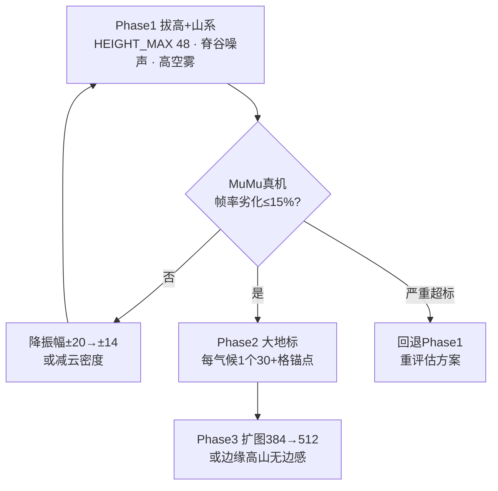
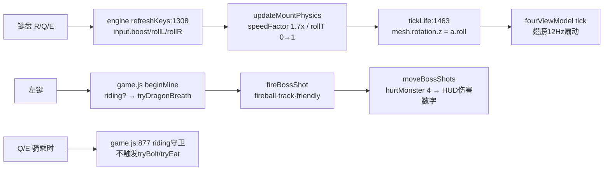

# 图解（Mermaid）

## 1. 本周期工作全景（已完成 → 待做）

```mermaid
flowchart LR
  subgraph done["✅ 本周期已完成(28/28测试绿)"]
    A[模块化 world-gen<br/>+测试基线0→28] --> B[树木贴图<br/>5色/树冠3层/叶色]
    B --> C[tileset无缝化<br/>dirt/stone/sand 0接缝]
    C --> D[氛围:15气候雾色/光色]
    D --> E[体素云层<br/>1 draw call]
    E --> F[骑龙全套:急速/回旋/龙息<br/>尾迹/键冲突修复/HUD]
  end
  F --> G
  subgraph todo["📋 待做"]
    G[P0 骑龙大世界Phase1<br/>HEIGHT_MAX 48/山系噪声] --> H[P1 龙息×语音暴击联动<br/>水面/相机]
    H --> I[P2 大地标/草摆动]
    I --> J[P3 扩图(真机帧率后议)]
  end
```

## 2. 骑龙大世界三阶段依赖



## 3. 骑龙输入链路（修复后）


