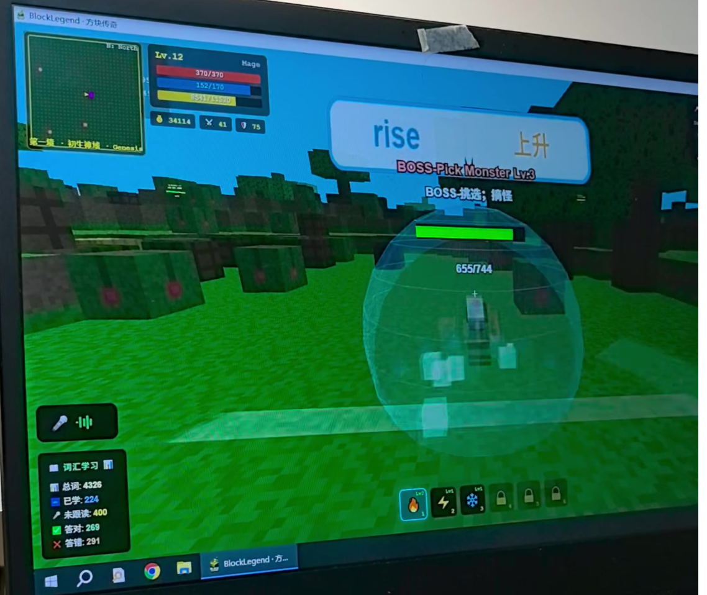
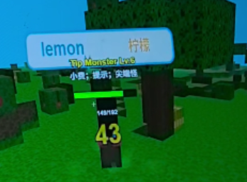
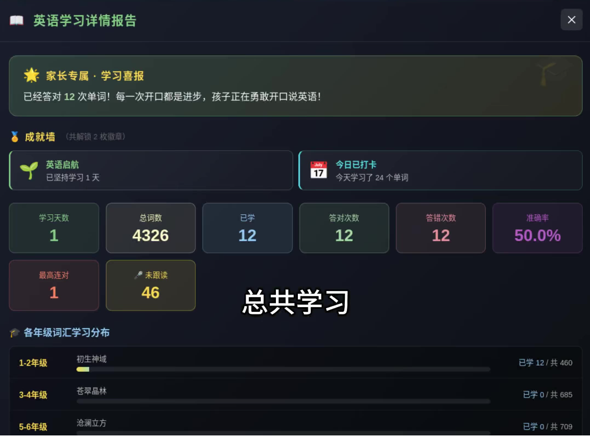
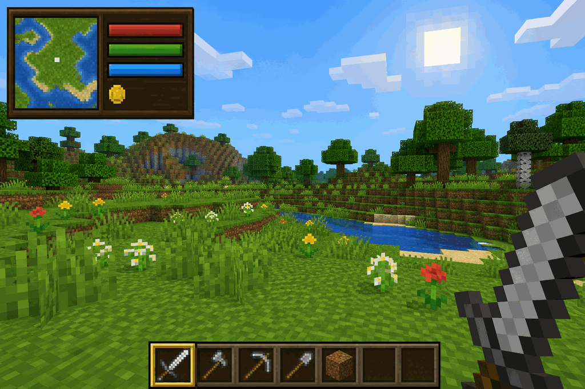

# BlockLegend 全方位优化分析与迭代路线图

> 分析日期：2026-08-16  
> 分析对象：`prj/games/blocklegend/` 当前工作区版本  
> 输出性质：产品、玩法、学习机制、美术、体验与工程的联合审计；不包含本轮代码改造  
> 核心目标：把“有很多功能的 3D 方块游戏”收敛成“孩子愿意反复玩的英语冒险”  
> 姊妹文档：[优化分析-玩法与美术-20260816.md](./优化分析-玩法与美术-20260816.md)（代码级缺陷清单，带文件行号：返回链接指错、MP 节点缺失、铁器配方原料错误、挖词块免答题记正确、小地图每帧全图扫描等，可直接作为修复工单）
> 附图复核更新：已按 2026-08-16 更新后的高清截图补充语音状态、世界内词卡、Boss 护盾、技能成长、学习报告、关卡解锁、商人及帮助面板分析；详见 3.2 节

---

## 0. 结论先行

BlockLegend 已经越过“能不能做出浏览器 3D 方块世界”的阶段。当前版本具备程序化体素世界、区块流式加载、像素图集、顶点 AO、挖放方块、工具分工、合成、波次战斗、追踪魔法、Boss 护盾、商店、6 个气候关卡、词库接入、看物识词、单词方块、单词闸门、7 种题型、错词拼写和工作台进度回流。实机首屏稳定显示 60fps，技术底座和功能数量都已经相当可观。

当前最大问题不是功能少，而是主线不够聚焦：

1. **学习是多个局部弹窗和数值规则，还没有成为玩家一眼能理解的核心能力。**2026-08-16 新附图把参考设计钉死了：对准怪物出现 `pack / 打包` 词牌，左下实时显示识别文本，帮助写明 `V: Voice Challenge (Say monster name)`；在所展示的普通怪与 Boss 片段中，学习反馈直接发生在战场上。当前版本识别函数已有，但第一击仍 `openQuiz` 暂停战斗，开口被关在测验层里。下一刀见 [plans/2026-08-16-05-voice-world-loop.md](../plans/2026-08-16-05-voice-world-loop.md)。
2. **开局缺少明确目标。**玩家进入后能看见许多 UI 和按键，却不知道本局应该先做“砍树、学词、过门、打怪”中的哪一件，也不知道它们如何汇成通关目标。
3. **系统广度大于有效深度。**合成表已有大量道具，但真正能放置或产生玩法作用的方块很少；6 关更换气候和怪物阵容，却都使用同一个 Wither Boss；建造编辑不会随关卡持久保存，削弱了沙盒投入感。
4. **美术已经形成像素体素雏形，但视觉语言不统一。**世界、木框 RPG 面板、灰色 MC 快捷栏、系统字体、Emoji 图标和中英混排同时出现，功能可辨认但不像一个完整原创品牌。
5. **工程底座比参考文档描述的更先进，但图集内容仍是 Fable5 噪声。**`DS-我的世界-3D-参考2.md` 所列结构（流式区块、程序图集、AO、准星描边、挖掘裂纹）已经落地，不要重写引擎，也不要接 Oasis/Marble/Meshy。2026-08-17 重判：用户仍觉得不好看，下一刀美术是**原创色手绘 16×16** 换掉噪声填充，不是再补一套 MC 基础。见 [美术后续优化方案](./2026-08-17-美术后续优化方案.md)。学习闭环（不停战开口）仍然优先于开美术工单。

建议的产品北极星是：

> **看见英文、听见英文、说出或拼出英文，让魔法立刻改变世界。**

最优先的一刀不是再加怪物、方块或配方，而是做通首个 8–12 分钟体验：**任务引导 → 自然接触 5 个词 → 开口/拼写施法 → 破盾击败 Boss → 看见掌握进度与新区域解锁**。

网页过肩陪玩（看见主角、提醒开口、G 键语音对话）见 [AI接入方案-过肩陪玩-20260816.md](../AI接入方案/AI接入方案-过肩陪玩-20260816.md)。它排在不停战开口之后，不替代 V 键战斗。

---

## 1. 分析范围与依据

### 1.1 已检查材料

- 当前项目入口与界面：`index.html`、`game.css`
- 游戏编排与学习交互：`game.js`
- 体素引擎与世界生成：`engine.js`
- 角色、怪物、第一人称工具与特效：`mobs.js`、`assets/img2threejs/`
- 配置与纯逻辑：`data/words.js`、`data/levels.js`、`data/combat.js`、`data/craft.js`、`data/tools.js`、`data/shop.js`、`data/skins.js`
- 工作台数据回流：`../shared/workbench-bridge.js`
- 测试：`tests/blocklegend.test.mjs`、`tests/learn-play-loop.test.mjs`
- 参考视频、转录和关键帧：`docs/参考项目/敢信！8岁小孩开发的学习英语游戏操作说明/`；2026-08-16 复核了更新后的高清裁切 PNG，重点覆盖语音状态、普通怪词牌、Boss 护盾、技能栏、学习报告、关卡解锁、商人和帮助面板
- 3D 技术/项目参考：`docs/优化方案/DS-我的世界-3D参考.md`、`docs/优化方案/DS-我的世界-3D-参考2.md`
- 已生成的 UI 概念图：`assets/generated/ui-refs/`

### 1.2 分析方法

本报告同时使用了四类证据：

- 静态代码追踪：从页面启动、世界生成、战斗触发、答题、奖励到工作台回流。
- 实机体验：本地浏览器打开当前首页和角色/工具预览，检查首屏构图、HUD、性能和错误日志。
- 参考对照：把视频中的“语音暴击、Boss 破盾、学习统计、关卡购买、交易”逐项映射到现版本。
- 自动测试：运行 BlockLegend 与学玩闭环相关的 52 项测试，当前为 **51 通过、1 失败**；失败是角色审查页测试仍要求静态 `data-kind="pig"`，而页面已改成 JavaScript 动态创建该属性，属于测试与实现不同步，不是主游戏加载失败。

### 1.3 边界说明

- 本报告以当前工作区快照为准；工作区存在多处未提交改动，因此结论不是对某个发布 Tag 的审计。
- 参考文档中的外部项目链接本轮未做联网复核，主要用于设计方向和技术清单对照。
- 参考视频的画质和 UI 完成度不是美术标杆；它最值得借鉴的是学习与战斗的因果关系。静态图只能证明被拍到的状态，未出现的交互不能据此断言“不存在”。

---

## 2. 仓库地图与当前核心链路

### 2.1 Repo Map

| 模块 | 当前职责 | 关键文件 | 评价 |
|---|---|---|---|
| 页面壳与 HUD | Canvas、状态栏、快捷栏、答题/结算/合成/商店/帮助层 | `index.html`、`game.css` | 功能完整，信息密度偏高 |
| 体素引擎 | 世界生成、区块网格、图集、AO、碰撞、挖放、流式渲染、第一人称相机 | `engine.js` | 当前最成熟的底座之一 |
| 游戏导演层 | 关卡、波次、怪物、战斗、掉落、学习触发、商店、结算、存档 | `game.js` | 约 2000 行，职责过多、迭代风险上升 |
| 角色与反馈 | 怪物模型、第一人称手臂/工具、伤害字、粒子、箭/魔法 | `mobs.js`、`assets/img2threejs/` | 已有一致体素基础，原创辨识度不足 |
| 学习逻辑 | 597 词卡加载、分关词池、题型、干扰项、错词升级、看物标签 | `data/words.js` | 题型丰富，调度与反馈仍偏“考试” |
| 战斗/关卡 | 伤害、连击、追踪弹、怪物表、6 关参数、Boss 护盾 | `data/combat.js`、`data/levels.js` | 纯函数化良好，关卡差异仍较浅 |
| 生存制造 | 工具效率、掉落、2×2/3×3 合成、装备与商店 | `data/tools.js`、`data/craft.js`、`data/shop.js` | 内容多，但有大量未产生实际用途的配方 |
| 成长回流 | 游戏进度、英语掌握度、阳光奖励、工作台元进度 | `../shared/workbench-bridge.js` | 已接通，游戏内呈现不足 |
| 验证 | 纯函数、结构、资源与学玩闭环回归 | `tests/blocklegend.test.mjs` 等 | 覆盖广，但部分是源码正则断言，缺真实交互 E2E |

### 2.2 当前游戏主链路

```text
打开页面
  → 载入工作台进度与 597 词卡
  → 按关卡切分词池并生成气候世界
  → 生成商人、波次怪物、单词方块和单词闸门
  → 挖掘/建造/战斗
      ├─ 看向物体：显示中英名，部分自动朗读
      ├─ 打怪首击：弹出答题卡，答对获得暴击/连击
      ├─ 顽固错词：T 键输入英文施法
      ├─ 单词方块：金币 + HP + 词进度
      └─ 单词闸门：答对后开门
  → 清波次
  → Boss：每 3 次攻击再问词，答对削盾，破盾进入输出窗口
  → 通关：阳光奖励、金币解锁下一关、进度回写工作台
```

### 2.3 当前学习链路

```text
词库 catalog
  → 按主题排序后平均切成 6 份
  → 优先抽取未见过的词
  → 默认中英选择题
  → 定期加入例句题
  → 连续错词升级为拼写/填空
  → 结果写入 courseProgress.minecraft.mastery
  → 工作台调度 +1 天或 +3 天复习
```

值得肯定的是，工作台层已经具备复习调度：测试证明正确词会安排约 +3 天复习，错误词约 +1 天复习。问题在于游戏内部主要显示“见过多少词、对/错多少次”，玩家看不到“正在掌握、待复习、已经稳固”的差异，`learnedIds` 又在首次正确时立即计入，容易把“答对一次”误读为“学会”。

---

## 3. 参考项目真正值得借鉴的部分

### 3.1 视频参考的核心不是功能数量，而是行为诱因

参考视频展示的关键机制可以压缩成四条：

1. 普通攻击伤害低，**念出怪物绑定的单词即可暴击**。
2. Boss 有明显护盾，**念词才能高效破盾**，蓝色变红色后进入爽快输出窗口。
3. 词汇学习、已学/未读、答对/答错持续显示，孩子能看到积累。
4. 打怪得钱、交易、购买后续关卡，把“想继续玩”转化成“愿意继续学”。

它的优势是闭环非常短：

```text
想更快打赢 → 开口念词 → 立刻暴击/破盾 → 得到更大奖励 → 想挑战下一关
```

当前版本已经实现第 2、3、4 条的大部分结构，也把题型和沙盒系统做得更丰富；但最具差异化的第 1 条仍未真正实现。现在只有 TTS 朗读，没有麦克风识别，孩子“说英语”没有直接改变战局。



### 3.2 新版附图补充分析（2026-08-16）

更新后的附图把原视频中模糊的界面细节变成了可核对证据。它们没有改变本报告的主方向，但使“应该学什么”和“必须避开什么”都更具体。

#### 3.2.1 截图证据与产品含义

| 画面证据 | 可以确认的机制 | 对 BlockLegend 的直接含义 |
|---|---|---|
| `pack / 打包`、`lemon / 柠檬`、`rise / 上升` 以大号双语词牌贴近怪物或 Boss | 单词不是脱离战斗的测验材料，而是当前敌人的身份/弱点 | P0 增加“怪物绑定词卡”；玩家必须一眼看出“我要念谁、念什么” |
| 左下麦克风面板持续显示识别文本，并出现 `not matched`、`mic blocked` | 语音输入有明确状态反馈，权限或匹配失败不会静默 | 语音不能只有成功回调；必须设计完整状态机、恢复按钮和拼写回退 |
| 正确发音后出现大号黄色 `43`，Boss 破防后出现 `133` | 学习动作与高伤害在空间和时间上紧邻 | 成功反馈应在识别确认后立即出现，并同时改变伤害字、音效、敌人状态和任务进度 |
| Boss 外层有半透明球形护罩，名称下另有状态文字；旁白说明破防后由蓝转红 | Boss 的“当前是否该输出”能被玩家观察 | 当前版本应保留护盾，但用材质形状、裂纹、阶段词和音效共同表达，不能只依赖蓝/红 |
| 底部是 6 个技能槽，前三个技能带等级，后三个上锁 | 快捷栏还承担成长预告和技能解锁 | 可借鉴“未解锁能力可预见”，但第一局只显示已开放技能；不要把 MC 物品栏和技能栏混成一排 |
| 左下常驻总词/已学/未跟读/答对/答错，独立报告再展示喜报、徽章、30 天曲线和逐词详情 | 游戏反馈与家长分析是两个层级 | 常驻 HUD 只保留本局目标；详细正确率、逐词记录和趋势移到家长/工作台报告 |
| 传送面板把后续关卡与等级、金币价格、年级主题绑定 | 探索目标被显式预告，学习与经济共同形成期待 | 关卡卡片要提前展示主题、独特任务、Boss 和解锁进度；采用金币/掌握度双路径，避免纯刷怪 |
| 商人有世界内 `F` 交互提示；右上问号可展开完整英文操作表 | 情境提示比一次性教程更贴近动作 | 保留靠近对象才出现的交互提示；完整帮助默认折叠，并提供中文解释 + 英文关键词 |





#### 3.2.2 借鉴边界：复制因果清晰度，不复制界面密度

| 应该借鉴 | 不应照搬 | BlockLegend 的改造原则 |
|---|---|---|
| 词牌与当前敌人直接绑定 | 词牌过大、同时遮挡世界和敌人 | 同屏只突出当前目标；距离远时缩成英文关键词，锁定/挑战时再展开中文与发音 |
| 麦克风结果实时可见 | 麦克风面板长期占据左下角 | 仅在监听、识别和失败后的 2–3 秒出现；空闲时收成声波图标 |
| 发音成功立刻高伤害 | 只靠黄色数字表达“为何变强” | 数字旁加声波/破盾图标，并让任务计数同步推进 |
| Boss 护盾有显著空间形态 | 只靠护盾颜色判断阶段 | 护盾完整度、裂纹、阶段名、音效四通道一致变化 |
| 后续技能和关卡可预见 | 六槽、地图、属性、统计、帮助全部常驻 | 逐步开放；首局始终可见信息控制在生命、目标、当前技能、准星四类 |
| 家长报告有鼓励语和逐词数据 | 把总词库 `4326`、答对/答错等考试数字长期压在儿童视野 | 儿童页讲“今天会了什么”，家长页讲“依据是什么、下一步复习什么” |
| 世界内靠近提示 | 中英混排、字号小、长操作表覆盖战场 | 情境提示只写一个动作；帮助页再放完整键位，可切换中英说明 |

新版附图因此强化了三个优先级：**P0 世界内双语词卡、P0 可恢复的语音状态、P0 学习结果与战斗反馈同步**。六槽技能、完整统计和大地图属于后续成长层，不能抢占首局资源。

### 3.3 两份 3D 参考文档的有效结论

两份文档提出的基础清单是正确的：第一人称、程序化地形、挖放方块、碰撞、图集、区块加载、AO、目标描边、裂纹反馈、HUD 和世界存档。这些是“像一个方块游戏”的必要底座。

但需要更新判断：当前代码已实现以下内容，不应再次作为主里程碑：

| 参考建议 | 当前状态 | 代码证据 |
|---|---|---|
| 16×16 程序化像素图集 | 已实现，多材质分面，NearestFilter | `engine.js:691-1038` |
| 草块顶/侧/底差异 | 已实现 `faceKind` / `tileIndex` | `engine.js:617-675` |
| 顶点 AO | 已实现 AO 曲线与逐顶点明暗 | `engine.js:1313-1408` |
| 区块流式加载 | 已实现 16×16 Chunk、视距半径和逐帧预算 | `engine.js:15-17`、`engine.js:1634-1658` |
| 挖掘裂纹 | 已实现 4 阶段裂纹贴图与叠层 | `engine.js:44`、`game.js:822-925` |
| 准星目标反馈 | 已实现方块目标框、怪物脚下红环与铭牌 | `game.js:960-1064` |
| 村庄/水塘/洞穴/矿石 | 已实现 | `engine.js:104-573` |

因此，下一轮如果继续大量“抄 MC 技术清单”，边际收益会很低。更值钱的是把现有底座服务于原创玩法与学习闭环。

### 3.4 UI 概念图的正确用法

项目内已有三张生成式概念图，方向分别是木框状态 HUD、准星小铭牌、橡木答题板。它们适合作为构图和材质语言参考，不适合直接当最终资产：图中世界细节、光照和纹理完成度高于当前实时引擎，如果照搬面板而世界不升级，会产生“UI 很精致、游戏世界像另一款产品”的割裂。



建议抽取共性：**深木底、金色焦点框、像素内描边、少量羊皮纸、三档字号**，而不是追求逐像素复刻。

---

## 4. 当前版本体验评分

评分用于确定投入顺序，不代表代码质量排名。

| 维度 | 评分 | 当前优势 | 主要缺口 |
|---|---:|---|---|
| 核心创意 | 7/10 | 方块沙盒 + 英语战斗有清晰卖点 | “说英语改变战局”尚未落地 |
| 即时玩法 | 6.5/10 | 挖、放、打、魔法、掉落反馈齐全 | 开局目标不清，战斗 AI 与波次重复 |
| 学习设计 | 6/10 | 7 种题型、错词升级、工作台复习回流 | 首击弹窗打断，错误纠正弱，未区分见过与掌握 |
| 关卡设计 | 5/10 | 6 气候、不同怪物阵容和价格门槛 | 同 Boss、固定波次、缺任务和区域叙事 |
| 沙盒/合成 | 5.5/10 | 工具分工、2×2/3×3 合成结构完整 | 多配方无实际用途，建造不持久 |
| 经济与成长 | 5.5/10 | 掉落—售卖—装备—解锁链路已通 | 金币容易成为唯一目标，学习掌握未参与解锁 |
| 世界美术 | 6.5/10 | 体素图集、AO、气候天空、村庄和生物丰富 | 饱和度高、光照偏平、原创识别度不足 |
| UI/信息设计 | 5.5/10 | 信息齐全、操作都有入口 | 首屏拥挤、字号偏小、中英与材质语言不统一 |
| 动效/音效 | 4.5/10 | 伤害字、粒子、红闪、少量合成音效 | 缺脚步、命中、挖掘、环境、Boss 分层音频 |
| 性能与底座 | 8/10 | 实机 60fps、Chunk、图集合批、无阴影策略合理 | 缺设备档位和持续性能基线 |
| 移动端/无障碍 | 3/10 | 有窄屏 CSS、拖动视角雏形 | 无触屏移动/攻击；颜色、字号、音频设置不足 |

综合判断：**底座 8 分，产品闭环 5–6 分。下一阶段应把产品闭环追上底座，而不是继续扩大底座。**

---

## 5. 玩法层面的核心问题与优化方案

### 5.1 P0：开局没有“单一、可见、会推进”的任务

当前首屏同时告诉玩家 WASD、1–9、左/右键、C、Q、F、鼠标锁定、Say 词表、词汇统计和角色数值。熟悉 MC 的玩家能探索，新手儿童很可能只会随机点按。

#### 建议：用三段式新手任务替代一次性帮助列表

第一局只开放必要动作，其余系统随任务出现：

1. **寻找会发光的橡树**：WASD 移动；准星指向时显示 `tree · 树` 并朗读。
2. **砍 1 块原木，做一把木剑**：只高亮 1、2 和 C；完成后剑槽发光。
3. **听懂并击败史莱姆**：先展示 `slime`，再让玩家选择/说出含义，正确后第一次暴击。
4. **学习 5 个词，打开单词门**：HUD 只显示 `2/5`，门在小地图上闪烁。
5. **用 3 个词击破 Boss 护盾**：把“学习目标”和“战斗目标”合成一个目标。

验收标准：首次玩家在无人指导下，90 秒内完成第一次有效学习攻击；3 分钟内理解“学词会更强”。

### 5.2 P0：把语音/拼写变成核心技能，而不是错词补救

当前选择题适合低门槛识别，T 键拼词适合回忆，但参考项目最有吸引力的是开口施法。建议提供三种同时存在的施法通道：

| 通道 | 适用场景 | 玩法效果 | 失败处理 |
|---|---|---|---|
| 说出单词 | 默认核心，能使用麦克风的设备 | 即时暴击、护盾削减、短暂击退 | 显示识别文本；可重听、慢速读、改用拼写 |
| 拼出单词 | 安静环境、识别失败、顽固词 | 同等或略高伤害，形成主动回忆 | 给首字母/音节提示，不扣金币 |
| 选择含义 | 新词第一次出现、低龄模式 | 正常暴击，保证入门 | 错后展示正确答案并立即重试一次 |

新版截图中的 `not matched` 和 `mic blocked` 说明，语音体验的难点不是“能否调用识别 API”，而是玩家能否理解当前发生了什么。建议显式设计以下状态：

| 状态 | 玩家看到什么 | 下一步动作 |
|---|---|---|
| Idle | 小型声波图标，不占面板 | 对准带词怪物，按住/按下 V |
| Permission | “允许麦克风，用来识别当前单词；不保存录音” | 允许，或直接选“改用拼写” |
| Listening | 目标词高亮、声波跳动、`正在听…` | 说出词；Esc/再次按 V 取消 |
| Matched | 识别文本 + 对勾 + 声波命中轨迹 | 自动结算暴击/破盾，不再要求确认 |
| Not matched | `听到：pardon` 与目标词并列，不使用笼统“失败” | 重听目标词、再说一次、改用拼写 |
| Mic blocked | 麦克风划线图标 + 权限说明 | 打开浏览器权限帮助，或改用拼写 |
| Timeout / No speech | “没有听清”而不是“念错了” | 重试、调高输入提示、改用选择 |
| Unsupported | “此浏览器暂不支持语音” | 自动切换拼写/选择，通关不受阻 |

语音必须是“强推荐、非强制”：浏览器兼容、环境噪声、口音和隐私都可能失败。第一次申请麦克风前解释用途；不保存原始录音；设备不支持时自动落到拼写或选择，不应阻断通关。状态不能只靠红/绿色区分，需同时有图标、短文案和声音；从获得最终识别结果到出现首帧战斗反馈，产品内处理目标应不超过 300ms。

### 5.3 P0：减少暂停式题卡，增加世界内学习

当前普通怪首击弹出全屏层并暂停，Boss 按血量再弹题。新版附图能确认：参考项目在所展示的普通怪和 Boss 片段中，把词牌、识别文本、护盾与伤害都放在战场上，没有切换到独立全屏题卡；但不能据此断言它在所有模式中“从不弹题卡”。BlockLegend 的落地方向仍应是：砍怪不停战，V 挑战准星目标词。

建议采用三档呈现：

1. **世界内铭牌**：新词暴露、看物识词、发音，永不暂停。
2. **准星旁快速挑战**：两选一、语音、短拼写，怪物减速但不完全暂停；适合普通战斗。
3. **木板大题卡**：只用于新题型教学、Boss 阶段转换和关卡结算；视觉要有仪式感。

“是否暂停”也可进入难度设置：亲子/初学模式暂停，熟练模式时间减速 70%，挑战模式不停。

怪物绑定词卡的验收要求：同屏只展开当前锁定目标的一张卡；卡片与怪物头顶保持稳定关联，不因摄像机轻微移动抖动；英文是第一视觉层，中文和发音按钮是第二层；目标离开准星或视野后 1 秒内收起。1080p 下英文关键词建议 28–36px、中文 16–20px，卡片正文对比度至少 4.5:1。

### 5.4 P0：让普通攻击有用，但学习攻击明显更爽

参考视频说“不念会打得很慢”，新版截图又用发音后的黄色 `43`、破防后的 `133` 把差异直接可视化。方向正确，但不能让普通操作完全失效。推荐伤害层级：

- 普通命中：1.0×，有清晰命中反馈，可以慢慢赢。
- 看懂/选择正确：2.0×，黄色暴击字。
- 拼写正确：3.0×，紫色魔法、击退、连击 +1。
- 发音通过：3.0×，蓝色声波、护盾额外 -1。
- 连续 3 个不同词正确：团队式大招 4.0×，短时不再弹题。
- 错误：0.7–1.0×，不羞辱、不倒扣成长；给可操作提示。

当前代码的 3×/4×连击基础可以保留，重点是把倍率、视觉和来源讲清楚。

### 5.5 P1：每关必须有独特目标，不只是换天空和怪物

现有 `levels.js` 已数据化 6 个气候、波次数、Boss HP/盾值和怪物阵容，这是很好的扩展入口。建议增加 `missionType`、`wordThemes`、`bossMechanic`、`buildGoal`、`reviewRatio` 等配置，让每关有一句话能说清的体验。

详见第 9 节关卡重构表。

### 5.6 P1：修复“合成很多、实际无用”的内容债

当前合成表包含箱子、熔炉、门、栅栏、梯子、碗、船、剪刀、桶、钓竿等，但世界放置白名单只有泥土、石头、原木、木板、合成台；多数成品只是背包数字或被出售。

处理原则：**每个出现在配方书里的物品，必须至少影响一种玩家决策。**

- 箱子：保存本关建造材料，死亡不丢；教学词 `chest`。
- 熔炉：把矿石换成装备升级材料；教学 `furnace / iron / hot`。
- 火把：照亮洞穴并让附近怪物减速；教学 `light / dark`。
- 门/栅栏：构建安全区，怪物寻路不能穿过。
- 船/钓竿：若暂不做水上玩法，先从可见配方中移除。
- 木剑/石剑/铁剑：模型、伤害和槽位显示必须同步升级，而不是只在背包里加数。

### 5.7 P1：保存孩子真正投入的东西

目前进度会保存金币、背包、装备、关卡和词汇；世界编辑保存在内存中的 `world.edits`，重开关卡会重新生成世界。孩子花时间搭的房子会消失，这是沙盒体验中的高风险失望点。

推荐两种产品方案二选一：

- **冒险关卡不持久 + 独立家园持久**：最稳。战斗地图可重置，家园用于摆战利品、建造和展示已学词。
- **每关保存编辑差量**：按 `level + worldSeed` 存 `world.edits`，限制编辑数量并提供“重置世界”。

更推荐第一种，因为它能把“反复闯关”和“长期建造”分开，存档规模也可控。

---

## 6. 英语学习设计优化

### 6.1 从“见过”升级为“掌握阶段”

建议游戏内统一使用以下状态，而不是单个 `learnedIds`：

| 阶段 | 判定示例 | 游戏表现 |
|---|---|---|
| 新词 New | 从未答过 | 带图片/中文/完整发音，不限时 |
| 熟悉 Familiar | 识别题答对 1 次 | 可用于普通怪选择题 |
| 回忆 Recall | 拼写或听力答对 2 次 | 可用于精英怪、奖励提高 |
| 开口 Spoken | 发音通过 1–2 次 | 解锁声波皮肤/徽章 |
| 掌握 Mastered | 跨至少 3 天、混合题型稳定正确 | 进入低频复习，不挤占新词 |
| 待复习 Due | 到达复习时间 | 当日任务优先刷新 |

工作台已经保存尝试、正确数和复习日期，可优先复用，不必另造完全独立的学习数据库。

### 6.2 词池不应只按主题排序后平均六等分

当前 `poolForLevel` 将所有词按主题排序后平均分 6 份，简单但不等于课程进阶。词卡已有 `curriculumLevel`、分类、例句和干扰项，建议组合以下规则：

1. 先按工作台当天课程和复习到期词确定 60% 词池。
2. 20% 使用当前关卡世界中的实体词，如 tree、water、sword、fox。
3. 20% 使用新词，按 curriculumLevel 和词频递进。
4. 每局只聚焦 5–8 个目标词，其余为环境曝光，不计硬性掌握。
5. 相似词避免同局首次出现，例如 `ship/sheep` 可在熟悉后作为听辨挑战，而不是新手干扰。

### 6.3 错误必须产生教学，不只是记一次 wrong

当前答错后主要是计数、普通伤害或“再试试”。建议加入 6 秒内的微型纠错：

```text
答错
  → 正确答案高亮 + 自动发音
  → 显示一张图或一个短例句
  → 玩家复述/重选一次
  → 第二次成功只给正常伤害，不断连胜羞辱
  → 该词进入 1–3 分钟后的同局复现
```

对拼写错误，可按字母显示差异，不要只清空输入框；对发音识别失败，要区分“没听见”和“单词不匹配”。

### 6.4 例句要进入动作，而不是只显示文本

现有代码已经有 `phrase`、`phraseZh`、填空和句义题，但例句仍主要存在于题卡。可以将句子与世界任务结合：

- `Open the door.`：说/读后门打开。
- `Put the block on the table.`：实际放置方块。
- `Find the red flower.`：在世界中寻找目标。
- `The fox is behind the tree.`：方位理解任务。
- `Give three apples to Leo.`：交易任务。

这类“听懂指令并行动”的学习价值高于重复翻译题，也更符合 3D 世界的独特优势。

### 6.5 统计要对孩子有意义

当前显示 `词 0/100 · 0✓ 0×`，数据直接但有考试感。参考项目新版截图进一步证明了“同一份数据、两个消费界面”的必要性：左下常驻总词、已学、未跟读、答对、答错；详情报告又展示喜报、徽章、30 天曲线、年级分布与逐词准确度。数据很全，但全塞进儿童战场会让“4326 个总词”和红色答错数持续制造压力。

建议拆成三层：

| 层级 | 面向谁 | 只回答什么 | 推荐内容 |
|---|---|---|---|
| 战斗 HUD | 儿童 | 我现在要做什么？ | `本局目标词 3/5`、当前连击、待挑战目标 |
| 关卡结算 | 儿童/陪玩者 | 我刚刚获得了什么？ | 新会词、复习词、开口次数、解锁物、下一次目标 |
| 家长/工作台报告 | 家长/老师 | 学习是否真实、下一步是什么？ | 7/30 天趋势、逐词阶段、错因、发音/拼写证据、待复习清单 |

首屏只显示：

- 今日能量：`3/5 个目标词`
- 当前连击：用 0–5 格声波或火焰表现
- 待复习：只在结算页显示 `明天回来复习 3 个`

详细对错、尝试数和掌握趋势放到家长/工作台报告，不长期占据游戏视野。报告中的“准确率”要标注统计口径和样本数，不能把一次新词尝试的 0% 与真正的长期掌握混为一谈；鼓励语应基于可验证行为，例如“今天主动开口 12 次”，而不是笼统评分。

---

## 7. 战斗、Boss 与关卡节奏

### 7.1 普通怪需要行为差异

当前多数怪物核心行为是追向玩家并接触伤害，模型和速度不同，但玩家策略接近。建议优先做 4 种行为模板，不必为每个模型写一套 AI：

| 模板 | 行为 | 学习机会 |
|---|---|---|
| 追逐型 | 直线接近，适合基础词 | 快速选择/发音 |
| 远程型 | 停在距离外射击 | 听指令找掩体、拼写破箭 |
| 护盾型 | 正面减伤、侧后弱点 | 方位词 left/right/behind |
| 召唤型 | 召出带不同词的幼体 | 分类、复数、同主题词组 |

### 7.2 Boss 不应六关都只是同一个 Wither 数值成长

当前六关 `bossId` 都是 `wither`，视觉和机制重复。即便已有 Dragon/Storm 预览资产，也应先设计机制，再决定是否启用模型。

Boss 的学习阶段可统一为：

1. **识别阶段**：听/看 3 个目标词，打掉外层符文。
2. **回忆阶段**：拼写或说出 2 个词，进入 8 秒破防。
3. **应用阶段**：完成一个世界动作句，触发终结技。

不同 Boss 只替换空间压力和题型组合，系统复用率高。

新版截图确认球形外罩能让 Boss 盾与普通 HP 分离，这是值得保留的空间表达；但“破防后由蓝变红”在静态拍屏图里容易受色偏、透明度和背景影响。BlockLegend 应把阶段变化同时映射到：护罩完整/裂开/消失、`护盾中/可输出` 文字、盾牌图标和破裂音效。玩家在静音或色弱条件下也应能在 1 秒内判断当前阶段。

### 7.3 推荐的 6 关重构

| 关卡 | 现有气候 | 目标词方向 | 独特任务 | Boss 机制 | 学习要求 |
|---|---|---|---|---|---|
| 1 初生神域 | Plains | 颜色、基础物品、动作 | 砍树、做剑、找红花 | 史莱姆王/低压 Wither：说 3 个词破盾 | 新词识别 + 跟读 |
| 2 樱语林 | Cherry | 动物、自然、方位 | 按英语线索寻找狐狸与花 | 镜像狐：判断 left/right/behind | 听懂短指令 |
| 3 金沙遗迹 | Desert | 数量、食物、描述 | 收集指定数量资源，开启遗迹 | 石像守卫：拼写钥匙词 | 识别 → 拼写 |
| 4 暮色谷 | Duskvale | 高频动词、现在进行时 | 夜间护送村民、使用火把 | 女巫：根据动作句解除药水 | 句义与动作匹配 |
| 5 水晶境 | Crystal | 学校、物品、比较描述 | 按属性排列水晶 | 守望者：听辨近音词、组合短句 | 听辨 + 句子 |
| 6 炼狱终章 | Nether | 混合复习、跨主题表达 | 选择路线、合成终极装备 | 原创终章 Boss：多阶段回顾 | 到期词优先、主动回忆 |

每关只应引入一个新系统；后续关卡复用前面规则并提高组合复杂度。

---

## 8. 经济、成长与工作台联动

### 8.1 保留金币门槛，但让学习质量参与通关

参考视频中“有钱才能去下一关”能制造游玩动力，新版传送面板还明确列出关卡名、年级/主题、进入等级与金币价格；当前版本也已实现 50/150/300/500/800 金币解锁。可借鉴的是“让下一片区域提前可见”，而不是照搬巨额价格。单用金币会鼓励刷怪或卖材料，而不是学得更好。

推荐双条件，二选一即可解锁，避免卡死：

- 经济路线：足够金币。
- 学习路线：本关 5 个目标词达到 Recall，金币折扣 70% 或直接免票。

这样既保留刷资源的自由，也明确告诉孩子“学会能省力”。

关卡卡片建议固定显示四项：新区域缩略图、代表词主题、独特任务/Boss、双路径进度。例如：`金币 80/100` 与 `目标词 Recall 4/5` 同时可见，先满足任一路径即可进入。未解锁卡片应展示期待，不应用大锁和灰字隐藏全部内容。

### 8.2 把工作台奖励说人话

当前通关会奖励阳光并显示冒险元等级，但首次玩家未必知道阳光有什么用。结算页应显示真实去向：

```text
本关学会 3 个新词
复习稳固 2 个词
获得 8 阳光 → 独角兽成长 +8
明天将复习：fox, behind, flower
```

避免只展示系统字段或“已达上限”。达到上限时仍要强调学习进度已保存，只是不再发额外货币。

### 8.3 建议增加三类长期收集

- **词语图鉴**：每个词有世界截图、发音、掌握阶段和首次发现地点。
- **Boss 符文**：每关一枚，不靠概率，作为通关展示物。
- **家园摆件**：由掌握词解锁外观，不直接提高战斗数值，避免学习变成付费式门槛。

---

## 9. 美术设计分析与优化

### 9.1 当前世界美术优点

- 程序化 16×16 图集已经让草、土、石、树、矿物形成统一像素颗粒。
- 顶点 AO 显著改善方块接缝和体积感，低成本且适合当前无动态阴影策略。
- 6 套天空与雾色能快速区分关卡气候。
- 第一人称手臂和工具与镜头绑定，动作反馈比浮空工具自然。
- 村庄、水塘、洞穴、矿物、动物和云使世界不再是单一高度场。

### 9.2 当前世界美术问题

1. **饱和度过高。**首关荧光绿草地、纯蓝水体和高亮天空同时出现，视觉刺激强，但长时间观看容易疲劳，敌人和任务物也不容易从背景中跳出。
2. **材质噪声密度一致。**近景草、远景山、树叶和水面都有强像素噪声，缺少主次；远景应该更简化、低对比。
3. **无动态阴影虽合理，但接地感不足。**角色预览尤其明显，怪物像放在平面上。可用低成本圆形投影阴影、脚底 AO 贴片和受击方向光替代真正阴影。
4. **第一人称武器占屏偏大。**实机中右手/工具覆盖右侧较大区域，影响观察和 UI 安全区。
5. **视觉身份接近 MC。**Creeper、Wither、Enderman 等名称和轮廓会让项目被理解成模仿作品，不利于形成 BlockLegend 自有品牌，也有潜在知识产权风险。

### 9.3 建议的原创美术定位

推荐定位为：**“童话木刻 + 像素体素 + 英语符文魔法”**。

- 世界仍保留方块和程序化图集，保证性能与玩法基础。
- 每个可学习实体带一条很轻的金色/蓝色符文边，不再依赖大标签。
- 怪物不是直接复刻 MC，而是围绕“字母被污染”的主题：漏字史莱姆、乱序石像、噪声蝙蝠、镜像狐等。
- Boss 护盾由字母环、音节块和句子链组成，学习动作在世界里可见。
- 主色：自然绿/土褐；学习交互：符文金；语音：声波蓝；危险：珊瑚红；不要让所有高饱和颜色同时抢焦点。

### 9.4 UI 需要统一一套视觉语言

当前混合了：木框 RPG 状态栏、Minecraft 灰色快捷栏、网页按钮、Emoji 金币/武器/盾牌、系统中文字体、全英文帮助和局部中文提示。建议建立一页 UI 规范：

| 元素 | 建议规范 |
|---|---|
| 面板 | 深木色 9-slice，2px 暗边 + 1px 金色焦点边 |
| 快捷栏 | 同一木框体系，选中槽使用符文金，不再使用另一套灰色材质 |
| 图标 | 统一 16×16 或 24×24 像素图标，替换 Emoji |
| 字体 | 中文用清晰圆体/像素兼容字体，英文关键词可用像素标题体；1080p 正文默认不小于 16px，次要信息不小于 14px |
| 文案 | 儿童界面中文解释 + 英文目标词；不要半句中文半句系统英文 |
| 状态色 | 颜色之外再配图形/文字，例如蓝盾 + 盾牌图标、破盾 + 裂纹图标 |
| 动画 | 120–180ms 点击，250ms 奖励弹出；避免持续闪烁 |

儿童学习游戏可以使用明快色和块状构图，但必须限制同时竞争的强调色。正文与底板对比度至少 4.5:1；大数字、图标和颜色用于结果反馈，不能替代文字含义。

### 9.5 HUD 信息层级重排

建议将 HUD 分为三层：

1. **始终可见**：生命、当前工具、目标词进度、准星。
2. **情境出现**：Boss 血条、商人提示、挖掘条、目标铭牌、语音识别结果。
3. **按键展开**：小地图、金币/攻防详情、学习统计、帮助、背包。

新版参考图同屏长期占据六个区域：左上地图、顶部角色属性、左下麦克风、左下学习统计、底部技能栏、右侧操作帮助。它证明功能齐全，却也证明这些模块不应全部常驻。BlockLegend 应围绕一条视觉路径排布：

```text
当前目标词 → 绑定怪物/Boss → 识别状态 → 伤害/破盾结果 → 任务进度
```

这条路径之外的信息默认降级或折叠。尤其不要让累计总词数、角色攻防、完整键位表与当前目标词使用同等亮度和字号。

具体调整：

- 左上大面板默认折叠为小地图按钮 + 当前任务 `学习 2/5`。
- 顶部鼠标锁定提示在第一次成功锁定后永久淡出。
- 右下长快捷键串只在前 30 秒和帮助页出现。
- 底部快捷栏保留，但道具数量、锁定状态和当前用途要更清晰。
- 准星铭牌只显示两行：`slime` / `史莱姆`；HP 放到怪物头顶，不再形成第三行。
- Boss HUD 使用图标和阶段名，不只靠蓝/红色。
- 麦克风空闲时仅显示 32–40px 声波入口；监听时扩展成不超过两行的状态条，结果停留 2–3 秒后自动收起。
- 技能栏只展示已开放技能和紧邻的一个待解锁槽；锁定槽说明放到技能页，不让三把锁长期占据战斗中心。
- 完整操作说明沿用“问号折叠”的思路，但首次只教当前任务所需按键；中文解释为主，英文命令作为学习内容而非系统障碍。

### 9.6 角色与怪物

当前像素皮肤生成和盒体模型已经有统一制作管线，下一步不应只增加数量，应先做“剪影、动作、受击反馈”三项质量门槛：

- 32px 缩略图仍能分辨怪物种类。
- 每种行为模板至少有待机、移动、攻击、受击、死亡五个状态。
- 受击同时有材质闪白、后坐、伤害字和短音效；死亡有收缩/散落，而非瞬间消失。
- 精英怪用轮廓、符文和动作区分，不只换颜色/加血。

### 9.7 音效与语音

当前共用 Web Audio 主要提供 checkpoint、celebrate、clear 等短音效，单词音频可从词库播放，失败后用浏览器 TTS。缺少让世界“有手感”的声音层。

建议按优先级补齐：

1. 命中/暴击/护盾碎裂/玩家受伤。
2. 草、石、木三类脚步与挖掘音。
3. 拾取、合成、购买、门开启。
4. 每气候一条 20–40 秒低密度环境氛围，不急着做完整音乐。
5. 语音识别成功用清晰声波上扬音；失败用中性提示，避免“错误蜂鸣”。

必须提供总音量、语音、音效三个开关；自动朗读不应每次看向实体都重复，现有 16 秒冷却方向正确。

---

## 10. UX、儿童体验、移动端与无障碍

### 10.1 儿童体验

- 不使用“错了”“失败”等强负面文案，改为“再听一次”“差一点，看看第 2 个字母”。
- 题卡初次出现不倒计时；熟悉后才引入时间奖励。
- 失败不清空全部关卡资源，避免长时投入被惩罚。
- 首局只展示 4 个核心按键，帮助页可保留完整操作表。
- 成人统计与儿童 HUD 分离，减少考试感。

### 10.2 移动端

当前代码有拖动视角和窄屏 CSS，但没有触屏摇杆、跳跃、攻击、放置、施法和物品栏交互闭环，不能视为可玩移动版。

建议分档：

- 第一阶段明确标注“桌面键鼠优先”，不做半成品移动入口。
- 若移动端是必需目标，增加左侧虚拟摇杆、右侧拖视角、攻击/互动/跳跃 3 个大按钮和长按挖掘；快捷栏支持横向滑动。
- 390×844 下所有关键按钮触控区至少约 44px，答题选项不低于 48px。
- 移动设备将视距从 3 Chunk 降到 2、pixelRatio 限制到 1、目标 30fps。

### 10.3 无障碍与设置

- Boss 护盾蓝/红变化必须同时显示形状和文字。
- 支持 UI 缩放 100%/125%/150%。
- 支持镜头灵敏度、反转 Y 轴、减少镜头晃动、关闭伤害闪屏。
- 字幕显示单词音频和识别结果。
- 麦克风功能必须有键盘等价路径。
- `not matched`、`mic blocked`、`timeout` 必须使用不同图标和恢复动作，不能共用一个红色失败态。
- 麦克风权限说明明确“不保存原始录音”；拒绝权限后不重复弹系统授权框。
- 增加真正的暂停/设置面板，而不只是退出鼠标锁定。

---

## 11. 工程与架构优化

### 11.1 不要重写引擎

`engine.js` 虽然接近 2000 行，但已解决 Chunk、图集、AO、世界生成、碰撞、挖放和性能约束。重写成另一个 MC Clone 风险大，会丢失学习实体、工作台桥接和现有回归测试。应做渐进拆分：

```text
engine/
  worldgen.js      地形、村庄、洞穴、词块/闸门布点
  atlas.js         图集、UV、材质
  mesher.js        可见面、AO、Chunk Geometry
  player.js        碰撞、移动、相机、输入
  world-state.js   edits、保存/恢复、版本迁移
```

### 11.2 优先拆 `game.js` 的导演职责

`game.js` 同时管理 DOM、输入、战斗、学习、商店、合成、关卡、存档和特效，新增语音或任务系统后会更难维护。建议先按边界提取：

```text
game/
  session.js       会话状态与持久化
  director.js      波次、Boss、通关
  combat-ui.js     目标、伤害、HUD
  learning.js      出题、纠错、语音/拼写通道
  quests.js        新手任务与关卡目标
  economy.js       掉落、商店、解锁
```

先提纯逻辑再拆文件，不要为了目录好看进行一次性搬家。

### 11.3 数据化关卡与任务

扩展 `data/levels.js`，避免把独特关卡继续写进 `game.js` 条件分支：

```js
{
  level: 2,
  climate: 'cherry',
  wordThemes: ['动物', '自然', '方位'],
  targetWords: 6,
  reviewRatio: 0.4,
  missionType: 'find-and-guide',
  bossId: 'mirror-fox',
  bossMechanic: 'direction-callout',
  unlock: { coins: 150, recallWords: 5 }
}
```

### 11.4 存档版本化

加入 `schemaVersion`，分别保存：

- 元进度：关卡、金币、装备、收集品。
- 学习进度：继续由工作台课程引擎负责，避免两套真相。
- 家园/世界编辑：独立压缩字段，设置上限和重置入口。
- 设置：音量、镜头、UI 缩放、语音偏好。

迁移函数必须容忍旧快照缺字段，现有 `emptyProgress + Object.assign` 可作为起点。

### 11.5 测试策略

现有纯函数测试是优势，应保留。需要减少对源码字符串的脆弱断言，并补真实路径测试：

- 单元：词池调度、掌握阶段、语音结果归一化、伤害倍率、任务状态机。
- 集成：答题结果是否同时改变伤害、Boss 盾和工作台 mastery。
- 浏览器 E2E：首局移动 → 砍树 → 答词 → 打怪 → 开门 → 通关。
- 视觉快照：1280×720、1440×900、390×844 三档 HUD。
- 性能：冷启动时间、首屏 Chunk 数、draw calls、三角数、1% low FPS、内存增长。

当前必须先修复角色审查页相关的 1 个失败测试：测试不应要求静态 HTML 中直接出现 `data-kind="pig"`，应验证运行后 DOM，或匹配 `id: 'pig'` 的数据源。

### 11.6 性能预算

当前桌面首屏实测显示 60fps，应把它变成持续门槛：

| 指标 | 桌面目标 | 移动目标 |
|---|---:|---:|
| 首次可操作 | ≤ 2.5s | ≤ 4s |
| 稳态 FPS | 55–60 | ≥ 30 |
| 视距 | 3 Chunk 半径 | 2 Chunk 半径 |
| pixelRatio | ≤ 1.5 | ≤ 1.0 |
| 同屏普通怪 | 6–8 | 4–6 |
| 语音/题卡打开 | ≤ 150ms | ≤ 250ms |

继续坚持“无实时阴影、图集合批、受影响 Chunk 局部重建”的路线；低成本假阴影比开启全场景阴影更合适。

### 11.7 本地、隐私友好的体验指标

无需先上远程埋点，可本地记录聚合事件供家长/开发调试：

- `tutorial_step_completed`
- `first_learning_attack_ms`
- `word_exposed / recognized / recalled / spoken`
- `quiz_abandoned / mic_fallback / correction_success`
- `boss_shield_breaks`
- `session_minutes / level_clear / death`

不记录原始录音，不把儿童自由文本上传到第三方。

---

## 12. 功能取舍矩阵

| 决策 | 功能 | 理由 |
|---|---|---|
| 保留并突出 | 看物中英铭牌、自动发音 | 低打扰、符合 3D 情境学习 |
| 保留并突出 | 答对暴击、Boss 破盾 | 参考项目最强的行为闭环 |
| 保留并突出 | 单词闸门、单词方块 | 把学习结果变成世界变化 |
| 保留 | 挖放、工具分工、Chunk、AO、图集 | 已成熟，是游玩基础 |
| 深化 | T 拼词施法 | 从“错词补救”升级为核心主动回忆通道 |
| 新增 P0 | 语音施法 + 拼写/选择回退 | 建立原创差异与开口价值 |
| 新增 P0 | 分步任务与首局引导 | 解决不知道做什么 |
| 新增 P1 | 家园或世界编辑存档 | 保护建造投入 |
| 深化 | 关卡配置、怪物行为、Boss 阶段 | 解决 6 关重复 |
| 收缩 | 无作用配方 | 避免背包数字和空承诺 |
| 延后 | 更多怪物、更多天空图 | 当前不缺数量，缺用途 |
| 延后 | 复杂昼夜、天气、TNT | 不直接改善学习闭环 |
| 重命名/重设计 | Creeper、Wither、Enderman 等强 MC 资产 | 建立原创品牌并降低 IP 风险 |

---

## 13. 分阶段实施路线图

工期是单人全职的粗估，实际应按团队与资产产能调整。

### Phase 0：冻结基线（1–2 人日）

目标：确认当前可运行版本，不让后续优化建立在漂移基线上。

- 修复 1 个失败测试，记录 52/52 基线。
- 保存 3 个视口的首屏截图和性能数字。
- 建立关卡 1 的完成漏斗事件。
- 明确桌面优先或移动必需，避免 UI 同时为两端妥协。

验收：测试全绿；首屏 60fps 基线可复现；有固定试玩脚本。

### Phase 1：做通前 10 分钟（5–7 人日）

目标：不加大系统，只让第一次体验可理解、可完成、能感到学习变强。

- 三段式新手任务。
- HUD 信息减半，显示唯一当前目标。
- 怪物绑定双语词卡：英文主层、中文/发音辅层，同屏只展开一个目标。
- 答错后正确答案、重听、立即重试。
- 第一关只聚焦 5 个词，Boss 需要其中 3 个词破盾。
- 结算显示学会/待复习/阳光去向。

验收：5 名目标年龄试玩者中至少 4 名无需口头提示完成首次暴击；至少 3 名能复述“学单词可以更快打怪”。

### Phase 2：语音与掌握闭环 MVP（7–10 人日）

目标：实现 BlockLegend 的核心差异。

- 语音施法适配层：Idle、Permission、Listening、Matched、Not matched、Mic blocked、Timeout、Unsupported。
- 拼写和选择回退，不支持麦克风也能完成。
- New/Familiar/Recall/Spoken/Mastered/Due 状态映射。
- 普通怪和 Boss 的发音挑战均使用世界内词卡；仪式化大题卡只用于首次教学和 Boss 阶段转换。
- 识别成功同步触发伤害字、声波轨迹、护盾/HP 变化、音效和目标进度。
- 隐私说明与音频设置。

验收：安静环境下 20 个常用词识别成功率达到可试玩水平；任何权限/兼容失败都能在两步内切到拼写；玩家能把词卡、当前敌人和伤害结果正确对应；最终识别结果出现后 300ms 内启动战斗反馈；原始录音不持久化。

### Phase 3：关卡与沙盒收敛（10–15 人日）

目标：让第 2–6 关值得继续玩。

- 至少 4 种怪物行为模板。
- 每关独立任务、目标词和 Boss 机制。
- 配方清理：只展示有用途道具。
- 家园或世界编辑差量存档。
- 金币/学习双解锁。

验收：6 关中任意两关的目标、战斗策略和学习题型都能被玩家明显区分；建造投入重新进入后仍在。

### Phase 4：原创美术、声音与设备适配（8–12 人日）

目标：从“像 MC 的学习 Demo”升级为“BlockLegend 品牌产品”。

- UI 9-slice、像素图标、字体与色彩规范。
- 降饱和和远景层级，加入低成本接地阴影。
- 角色重命名/原创轮廓试点，先做第一关敌人与 Boss。
- 命中、材质脚步、挖掘、破盾、环境音。
- 若移动端是发布目标，完成完整触控闭环和性能档位。

验收：遮住标题后，试玩者仍能通过 UI、符文和敌人轮廓认出这是 BlockLegend，而不是普通 MC Clone。

---

## 14. 可执行任务清单与验收标准

| ID | 优先级 | 任务 | 主要文件 | 验收标准 |
|---|---|---|---|---|
| BL-01 | P0 | 关卡 1 分步任务状态机 | `data/levels.js`、新 `quests.js`、`game.js` | 首次进入只显示一个目标；任务可恢复 |
| BL-02 | P0 | 首屏 HUD 减负 | `index.html`、`game.css` | 默认常驻信息不超过生命、目标、当前技能、准星；帮助/统计默认折叠 |
| BL-03 | P0 | 答错纠错与一次免罚重试 | `data/words.js`、学习 UI | 错后展示正确答案、发音、重试；记录结果不重复污染 |
| BL-04 | P0 | 语音施法适配接口 | 新 `speech-input.js` | 8 种语音状态均有可见反馈；Not matched 显示听到的文本；权限失败两步内可回退 |
| BL-05 | P0 | 拼写/选择回退 | `game.js`、`data/words.js` | 麦克风不可用时通关路径完整 |
| BL-06 | P0 | 第一关 5 词目标池 + 怪物绑定词卡 | `data/words.js`、`data/levels.js`、HUD | 同局新词数可控；同屏只展开当前目标词卡；卡片离开目标后自动收起 |
| BL-07 | P0 | Boss 学习阶段可视化 | Boss HUD、模型符文 | 玩家能分辨“识别/回忆/输出”三个阶段 |
| BL-08 | P0 | 修复当前失败测试 | `tests/blocklegend.test.mjs` 或审查页 | 相关 52 项测试全部通过 |
| BL-09 | P1 | 掌握阶段映射 | 工作台 bridge、学习模块 | HUD 不再把一次正确当“掌握” |
| BL-09A | P1 | 儿童结算/家长报告分层 | 结算 UI、工作台 bridge | 儿童页不常驻答错总数；家长页能查看趋势、逐词证据和待复习清单 |
| BL-10 | P1 | 关卡数据扩展 | `data/levels.js` | 任务、主题、Boss 机制无需在主循环硬编码 |
| BL-11 | P1 | 4 种怪物行为模板 | `data/combat.js`、导演层 | 追逐、远程、护盾、召唤均有单测 |
| BL-12 | P1 | 每关独立 Boss | `data/levels.js`、模型工厂 | 至少前三关机制与轮廓不同 |
| BL-13 | P1 | 配方有效性清理 | `data/craft.js`、放置逻辑 | 可见配方 100% 有实际用途 |
| BL-14 | P1 | 家园/世界 edits 存档 | `engine.js`、session | 重开后建造保留；有重置与版本迁移 |
| BL-15 | P1 | 双路径解锁 | `data/levels.js`、结算 UI | 金币或掌握度均可推进，不形成学习卡死 |
| BL-16 | P1 | UI 视觉规范与像素图标 | `game.css`、assets | 移除常驻 Emoji；面板/快捷栏统一材质 |
| BL-17 | P1 | 音效第一包 | `game-sfx.js` 或独立音频模块 | 命中、暴击、破盾、三材质挖掘可区分 |
| BL-18 | P1 | 设置面板 | `index.html`、session | 音量、语音、灵敏度、UI 缩放可保存 |
| BL-19 | P2 | 原创角色命名与剪影试点 | 角色模型/皮肤 | 第一关不依赖 MC 专有角色也能成立 |
| BL-20 | P2 | 移动触控闭环 | 输入层、响应式 CSS | 390×844 可完成移动、攻击、答题、通关 |
| BL-21 | P2 | `game.js` 渐进拆分 | 新 game 模块 | 功能行为不变，纯逻辑可单测 |
| BL-22 | P2 | 浏览器 E2E 与性能门槛 | tests/CI | 固定路径通关；FPS/启动退化可报警 |

---

## 15. 试玩与成功指标

### 15.1 第一轮 5 人可用性测试

目标年龄应与真实用户一致；开发者或熟悉 MC 的成人不能替代儿童试玩。

观察而非提示以下问题：

1. 是否知道第一步去哪、做什么。
2. 是否理解英文和攻击伤害之间的关系。
3. 第一次答错后是否知道如何继续。
4. 是否主动重听或再说一次。
5. 通关后是否想进入下一关，原因是装备、世界还是学习能力。

### 15.2 关键指标

| 指标 | 第一阶段目标 |
|---|---:|
| 首次有效移动 | ≤ 20 秒 |
| 首次学习攻击 | ≤ 90 秒 |
| 新手任务完成率 | ≥ 80% |
| 第一关完成率 | ≥ 60% |
| 学习弹窗中途退出率 | ≤ 15% |
| 错后重试成功率 | ≥ 60% |
| 目标词次日回忆率 | 比纯选择题基线提升 |
| 玩家能说出核心规则 | ≥ 80%：“说/拼英语会更强” |

不要只看总游玩时长。孩子可能因为迷路而玩很久，也可能因为重复刷怪而绕开学习；核心指标必须把“游玩行为”和“学习行为”绑定。

---

## 16. 主要风险

| 风险 | 影响 | 缓解 |
|---|---|---|
| 语音识别兼容与口音误判 | 核心玩法挫败 | 多通道回退、显示识别文本、允许自选难度 |
| 系统继续膨胀 | 功能多但首局更乱 | 每个版本只验证一个核心假设；新功能必须绑定任务 |
| 沙盒和课程目标冲突 | 玩家绕开学习或被强迫答题 | 普通攻击可通关，学习显著提效；双路径解锁 |
| 过度模仿 MC | 品牌弱、潜在 IP 问题 | 原创怪物、符文魔法、重新命名与轮廓设计 |
| 儿童数据与麦克风隐私 | 发布风险 | 本地优先、不保存录音、明确权限与家长入口 |
| 视觉概念图过度承诺 | 实机落差 | 只抽取 UI 语言；先在现引擎预算内做小样 |
| 大文件重构引入回归 | 破坏当前稳定底座 | 先补 E2E，再渐进提纯/拆分，不整仓重写 |
| 工作区持续并行修改 | 测试与文档快速漂移 | 建立发布基线、版本号和变更记录 |

---

## 17. 推荐的下一 Sprint

如果下一轮只能做 5 件事，按以下顺序：

1. **修复测试基线，锁定第一关试玩脚本。**
2. **做三段式新手任务和唯一当前目标 HUD。**
3. **为答错加入正确答案、重听和一次立即重试。**
4. **把第一关收敛成 5 个目标词，做怪物绑定双语词卡，并让 Boss 明确要求其中 3 个词破盾。**
5. **做语音施法技术 Spike，覆盖 Not matched/Mic blocked/Timeout，并始终保留拼写/选择回退。**

暂时不要优先做：更多怪物、更多配方、昼夜/TNT、复杂天气、替换整个引擎、继续生成大量 UI 概念图。

Sprint 验收不是“代码都写完”，而是邀请至少 5 名真实目标用户试玩，证明他们在 90 秒内理解并体验到：

> **英语不是过场考试，而是我在这个世界里的魔法。**

---

## 18. 最终判断

BlockLegend 当前最宝贵的资产不是某一个怪物模型，也不是某张天空图，而是已经打通的三层基础：

- 能玩的浏览器体素世界；
- 能进入战斗和世界交互的英语词卡；
- 能回流到个人工作台的长期成长数据。

它已经不需要证明“AI 能不能做一个 Minecraft-like Demo”。下一步需要证明的是：**孩子是否会因为想赢、想探索、想解锁，而自发地看、听、说、拼英语；并且第二天还愿意回来复习。**

只要围绕这个问题收缩功能、优化首局、恢复语音驱动的差异点，并让美术逐步脱离直接的 MC 影子，BlockLegend 有机会从功能堆叠的原型成长为具有原创辨识度的学习游戏。

